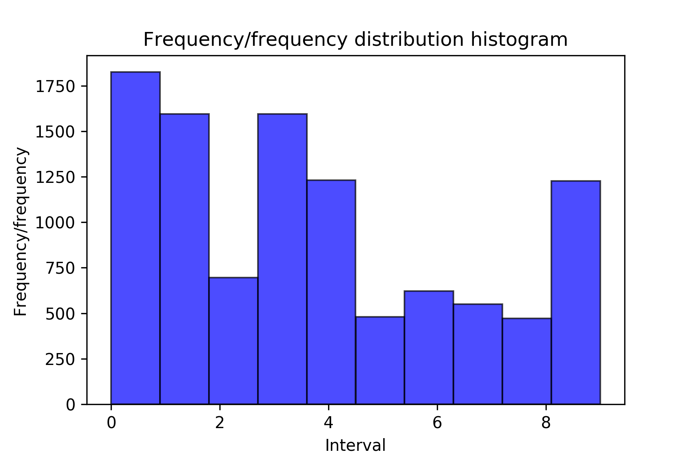
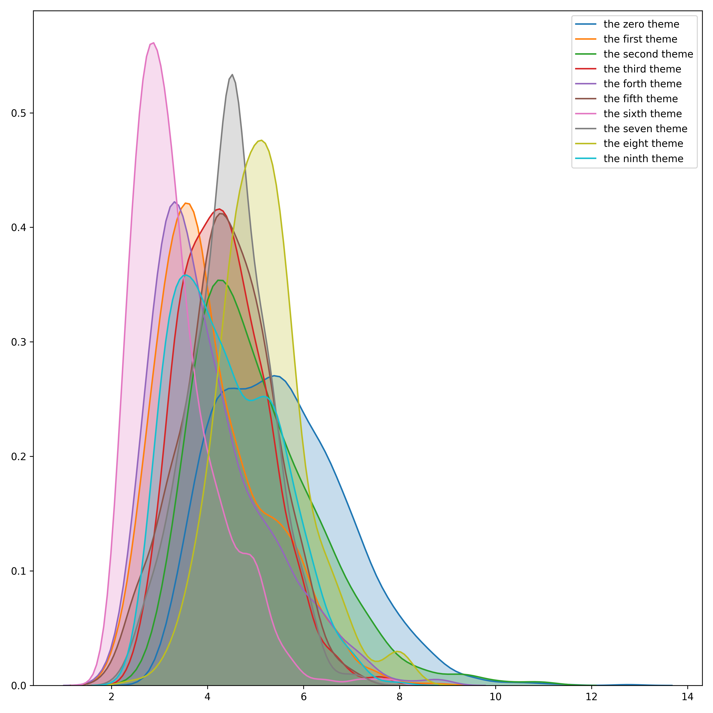
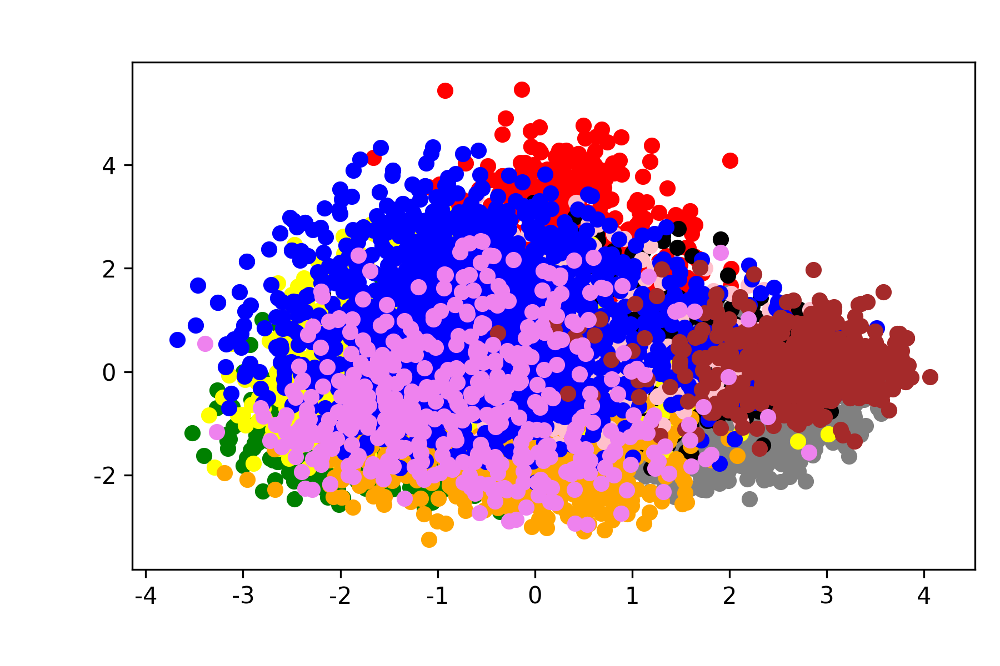

# news-covid-19

powerby [Cheng Deng](mailto:davendw@sjtu.edu.cn), [Bo Tong](bool_tbb@sjtu.edu.cn)

---

## Background

Unless we are living in the wild, without the Internet, mobile phones or computers, it is unrealistic to keep ourselves from watching the news and listening to the news. With the development of the epidemic, everything from calm in December to the peak of the epidemic at the end of January, When the country broke out in March, the news came from the lives of ordinary people to the numbness of epidemic reports. It seems that at this moment, our lives are dealing with viruses. Everyone in their own Weibo and circle of friends from sharing their own food and drink, work and study, to share the national epidemic situation, the hard work of medical workers.
Up to now, according to the CDC of various countries, there are more than 1.84 million confirmed cases of new coronary pneumonia in the world, and a total of more than 110,000 deaths. After four months, the focus of the epidemic is no longer China. Countries in the world ’s pandemic are responsible for their own epidemic development. As the epidemic changed, the domestic news broadcasts also changed, and international news also shifted from topics such as the 2020 US election and Brexit.

## Introduction

The Acemap team conducted text data analysis of domestic mainstream media through Flair + GloVe, and analyzed the directionality of news within a certain period of time through keyword word frequency analysis.

We selected all Weibo news from People ’s Daily, Xinhuanet, CCTV News and Surging News from December 1, 2019 to March 31, 2020. After performing certain data cleaning, GloVe was used for each news. Embedding vector representation, then using PCA to reduce the dimensionality of the vector, and finally performing cluster analysis between the topics and evaluating whether each topic is meaningful in the classification.

Here we take the news of Febraury as an example.

## Analysis

Frequency of each topic class:

The Keyword Distribution of each topic when Guassian:

The Similarity of each topic:

The Distribution of the News Vectors:
